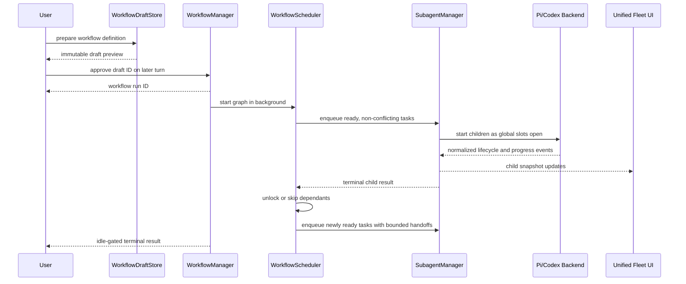

# Unified workflows in pi-subagents

## Orientation

Move workflow drafting, approval, scheduling, execution, progress, and control into `pi-subagents`, then retire `pi-workflows`.

The reason is ownership: `pi-subagents` already owns child identity, Pi/Codex backend execution, normalized lifecycle events, transcript state, cancellation, steering, result retention, and background parent delivery. A separate workflow extension necessarily duplicates those responsibilities or depends on a cross-extension protocol that makes progress and cancellation harder to reason about.

The target is one extension with two related managers:

- `SubagentManager` owns every child execution.
- `WorkflowManager` owns approved task graphs and schedules workflow-owned children through `SubagentManager`.

Generated workflows declare dependencies and filesystem scope. They do not choose a raw concurrency number. The scheduler derives safe parallelism from dependency readiness, scope conflicts, and the one shared agent queue.

We will implement one slice at a time in this thread. Each slice must leave a complete, tested behavior and stop for review before the next slice begins. No PR workflow is required.

## Settled decisions

1. `pi-subagents` becomes the only active repository and extension for subagents and workflows.
2. Workflow draft preparation and explicit later approval move into `pi-subagents`.
3. Workflow children execute through the existing `SubagentManager` and backend abstraction.
4. The manager queues excess work instead of rejecting it when capacity is full.
5. Workflow concurrency is derived; generated workflows do not set `concurrency: 1` or another raw pool size.
6. Tasks must declare either `readOnly: true` or explicit `owns` paths.
7. Workflows run in the background by default and return a run ID immediately after approval.
8. Dependency outputs are passed only through explicit, bounded handoffs.
9. Workflow state is an append-only event journal folded into a read model.
10. Child transcripts and live tool state remain owned by subagents; workflow records reference child IDs rather than copying transcripts.
11. Pi and Codex remain interchangeable behind `SubagentBackend`.
12. Process-restart resume is not part of the first migration. Interrupted runs must be reported honestly as orphaned/interrupted.
13. `pi-workflows` is archived only after feature cutover, saved-definition migration, and explicit final confirmation.

## Scope

### Move from pi-workflows

- Immutable draft creation and source hashing.
- Same-session, same-project, later-response approval boundary.
- Saved workflow discovery and immutable source snapshots.
- Restricted workflow definition evaluation.
- Run-level cancellation and first-terminal-reason-wins semantics.
- Useful run budgets and bounded artifacts.
- Background completion reporting.

### Rebuild around pi-subagents ownership

- Agent admission and queueing.
- Workflow task ownership and child linkage.
- Dependency and resource scheduling.
- Progress folding and observability.
- Task retry, skip, pause, and cancellation.

### Do not move

- Workflow-owned `createAgentSession()` execution.
- `pi-workflows/extensions/workflows/runner.ts`.
- Duplicate transcript and tool folding.
- A second process-global capacity pool.
- Mutable copied `AgentRecord` transcript projections.
- A workflow-specific cross-extension client protocol.
- Current lazy thenable behavior for `agent()`.

## Target production flow



## Authoritative state

| State | Owner | Representation |
| --- | --- | --- |
| Native child execution | `SubagentBackend` | `SubagentSession` |
| Child lifecycle, transcript, tools, result | `SubagentManager` | `SubagentSnapshot` folded from `SubagentEvent` |
| Immutable approved graph | Workflow draft store | source/spec snapshot plus digest |
| Workflow lifecycle and task dependency state | `WorkflowManager` | append-only workflow events folded into a read model |
| Scheduling readiness and scope locks | Workflow scheduler | derived in memory from workflow read model plus running child IDs |
| Parent result delivery | Existing parent coordinator/mailbox | bounded envelopes with safe parent reference |
| Fleet and detail UI | Derived projection | workflow read model joined to subagent snapshots by child ID |

## Core contracts

### Workflow task definition

```ts
interface WorkflowTaskDefinition {
  id: string
  label: string
  kind: "scout" | "writer" | "proof" | "review" | "repair"
  prompt: string
  needs?: string[]
  consumes?: string[]
  readOnly?: true
  owns?: string[]
  harness?: "pi" | "codex"
  model?: string
  effort?: ReasoningEffort
  retry?: {
    maxAttempts: number
    on: Array<"provider_stall" | "backend_failure">
  }
}
```

Exactly one scope form is valid: `readOnly: true` or a non-empty `owns` list.

### Workflow task lifecycle

```text
declared → blocked | ready
blocked → ready | skipped
ready → queued
queued → running
running → completed | failed | cancelled
failed → queued only through an explicit bounded retry
```

### Scheduling rules

- All `needs` must complete before a task becomes ready.
- A dependency failure skips only transitive dependants; independent branches continue.
- Read-only tasks do not conflict with each other.
- Writers conflict when either owned path equals or contains the other.
- Duplicate/overlapping writer ownership without an ordering dependency is rejected during draft validation.
- Global execution capacity belongs only to `SubagentManager`.
- Workflow scheduling may order work but may not create a second agent pool.

### Handoff rules

- `consumes` must be a subset of transitive dependencies.
- Each consumed result is labeled by task ID.
- Each handoff has its own byte/token bound.
- Full transcripts are never injected.
- Oversized details are represented by an artifact/session reference.

## Slice 1 — Shared queued execution authority

### Behavior delivered

`SubagentManager` becomes the sole queued admission authority for direct and workflow-owned agents. Capacity exhaustion queues work instead of rejecting a spawn.

### Files and symbols

- `extensions/subagents/src/domain.ts`
  - Add workflow ownership metadata to `SpawnTask` and `SubagentSnapshot`.
  - Add an explicit queued lifecycle state or a separate admission state without pretending execution has started.
- `extensions/subagents/src/manager.ts`
  - Replace `MAX_RUNNING` rejection in `spawn()` with FIFO admission.
  - Preserve synchronous reservation so concurrent spawns cannot over-admit.
  - Release slots only at terminal settlement.
  - Add stable settlement handles/results suitable for workflow consumers.
- `extensions/subagents/src/backend.ts`
  - Keep backend substitution unchanged; no workflow concepts enter backend implementations.
- `extensions/subagents/manager.test.ts`
  - Add queue ordering, fairness, cancellation, and slot-release tests.

### Execution boundary

```text
spawn(task)
  → create stable manager record
  → queued
  → acquire global slot
  → backend.spawn(task)
  → running
  → terminal settlement
  → release slot and drain queue
```

### Dependencies

None. This is the foundation for every later slice.

### Verification

- Fifth-and-later tasks queue rather than fail.
- FIFO order is preserved among equally eligible jobs.
- Cancelling a queued task never starts a backend session.
- Cancelling a running task releases capacity exactly once.
- Parallel spawn calls cannot exceed the configured running limit.
- Pi and Codex backend tests remain green.
- Full `npm run check` and `npm test` pass.

### Risk

The current manager creates a backend session during spawn. Queueing must move session creation after admission without losing stable IDs, parent ownership, or cancellation semantics.

## Slice 2 — Workflow event model and manager

### Behavior delivered

Introduce first-class workflow runs and task records without executing children yet. The workflow manager accepts a validated graph, records lifecycle events, folds a read model, and terminalizes once.

### Files and symbols

Create:

```text
extensions/subagents/src/workflows/
├── domain.ts
├── events.ts
├── reducer.ts
├── manager.ts
└── manager.test.ts
```

- `domain.ts`: workflow/task definitions, read models, terminal outcomes.
- `events.ts`: bounded discriminated event union.
- `reducer.ts`: pure event fold and invariant checks.
- `manager.ts`: run registry, event append, subscriptions, terminal ownership.

### State transitions

- Workflow: `pending_approval → running → completed | failed | cancelled`.
- Task: declared/blocked/ready/queued/running/terminal.
- Terminal state is first-write-wins.
- `lastActivityAt`, `startedAt`, and `finishedAt` remain separate.

### Dependencies

Slice 1 establishes child ownership vocabulary, but this slice can test its reducer without live execution.

### Verification

- Replay produces the same read model as live folding.
- Invalid transitions fail closed.
- Duplicate terminal events cannot change the outcome.
- Failed dependency folding marks only descendants skipped.
- Subscriptions receive monotonic progress versions.
- Event and log bounds are enforced.

### Risk

Do not turn the journal into a general event-sourcing framework. It is a bounded workflow progress record with one reducer.

## Slice 3 — Immutable drafts and approval

### Behavior delivered

Add the prepare/review/approve boundary inside `pi-subagents`. Preparing never executes. Execution requires the exact immutable draft on a later user response in the same session and project.

### Files and symbols

Create:

```text
extensions/subagents/src/workflows/
├── drafts.ts
├── provenance.ts
├── saved-workflows.ts
├── prompt.ts
├── tools.ts
└── drafts.test.ts
```

Reference the current implementations in:

- `../pi-workflows/extensions/workflows/drafts.ts`
- `../pi-workflows/extensions/workflows/saved-workflows.ts`
- `../pi-workflows/extensions/workflows/meta.ts`
- `../pi-workflows/extensions/workflows/prompt.ts`

Port contracts, not execution ownership.

### Boundary

```text
prepare(source/spec)
  → validate
  → hash exact execution inputs
  → persist pending draft
  → render review
later approve(draftId)
  → verify session/cwd/newer response/hash
  → create WorkflowManager run
```

### Dependencies

Slice 2 provides the workflow run authority.

### Verification

- Same-turn execution is rejected.
- Cross-session and cross-project approval is rejected.
- Modified persisted drafts fail closed.
- Saved definitions execute the reviewed source snapshot.
- Preparation produces no child or workflow run.

### Risk

Do not depend only on in-memory draft state; persisted artifacts and in-memory approval metadata must agree.

## Slice 4 — Declarative graph validation and scheduler

### Behavior delivered

Add `flow({ tasks })` as the generated workflow primitive. Validate the complete graph before execution and derive safe task readiness and concurrency.

### Files and symbols

Create:

```text
extensions/subagents/src/workflows/
├── graph.ts
├── scheduler.ts
├── handoff.ts
├── sandbox.ts
├── graph.test.ts
└── scheduler.test.ts
```

- `graph.ts`: decode and validate IDs, dependencies, cycles, consumes, and scopes.
- `scheduler.ts`: compute ready tasks and writer conflicts; no capacity pool.
- `handoff.ts`: bounded named dependency output assembly.
- `sandbox.ts`: evaluate only the restricted workflow-definition surface required to return a graph.

Update `workflows/prompt.ts` so generated drafts use `flow()` and omit concurrency.

### Dependencies

Slices 2 and 3.

### Verification

- Independent roots become ready together.
- Disjoint writers may be selected together.
- Overlapping writers serialize.
- Overlapping ownership without dependency order fails draft validation.
- Cycles, missing dependencies, invalid scopes, and invalid consumes fail closed.
- Handoff truncation is deterministic and secret-safe.

### Risk

Keep the first primitive declarative. Do not reintroduce arbitrary imperative scheduling, lazy thenables, or model-authored pools.

## Slice 5 — Background graph execution through SubagentManager

### Behavior delivered

Approved workflows detach immediately, schedule ready tasks through `SubagentManager`, receive authoritative child settlements, append workflow events, and unlock dependants.

### Files and symbols

- `extensions/subagents/src/workflows/manager.ts`
  - Add execution loop and child correlation.
- `extensions/subagents/src/workflows/scheduler.ts`
  - Integrate readiness with active scope ownership.
- `extensions/subagents/src/manager.ts`
  - Expose the minimum owner-safe settlement/read API.
- `extensions/subagents/src/domain.ts`
  - Finalize workflow owner fields.
- `extensions/subagents/index.ts`
  - Register workflow tools and lifecycle hooks.
- Add end-to-end workflow manager tests with stub backends.

### Execution path

```text
approve draft
  → register background workflow
  → select all ready, non-conflicting tasks
  → SubagentManager.spawn(workflow-owned task)
  → fold normalized child progress by child ID
  → receive child terminal result
  → append task terminal event
  → unlock/skip dependants
  → settle workflow
```

### Dependencies

Slices 1 through 4.

### Verification

- Approval returns before children settle.
- Independent tasks reach the manager in the same scheduling wave.
- Manager capacity queues excess work.
- Failure skips dependants but independent branches finish.
- Cancellation propagates to queued and running children.
- Workflow and each child settle exactly once.
- The same graph passes against Pi, Codex, and stub backend contracts.

### Risk

Avoid double admission. The workflow scheduler owns dependency/resource eligibility; `SubagentManager` alone owns execution capacity.

## Slice 6 — Unified observability and background delivery

### Behavior delivered

The existing subagent fleet becomes the single live surface for agents and workflows. Workflow task rows reference child snapshots. Completion uses the existing bounded parent mailbox.

### Files and symbols

- `extensions/subagents/src/workflows/projection.ts`
- `extensions/subagents/src/workflows/activity-protocol.ts`
- `extensions/subagents/src/ui/takeover.ts`
- `extensions/subagents/src/ui/activity-card.ts`
- `extensions/subagents/src/parent-mailbox.ts`
- `extensions/subagents/src/parent-coordinator.ts`
- `extensions/subagents/index.ts`

Add a workflow list/detail mode rather than a second independent dashboard implementation.

### Display contract

Show:

- blocked, ready, queued, running, skipped, and terminal tasks;
- dependency and ownership scope;
- backend/model/effort;
- current tool or provider/thinking state;
- completed operations and turns;
- retries and explicit stall reason;
- child transcript link using the existing child ID.

### Dependencies

Slice 5.

### Verification

- Opening a task displays the authoritative subagent transcript.
- Workflow records contain no transcript copy.
- Provider waiting and live tool execution render differently.
- Idle-gated delivery retries after a failed send.
- Explicit wait/consumption prevents duplicate automatic delivery.
- Activity updates are bounded and do not cause repaint/persistence churn.

### Risk

Do not merge the workflow journal and subagent transcript into one giant state object. Join them only in projections.

## Slice 7 — Controls, bounded recovery, and artifacts

### Behavior delivered

Add operator controls and honest persistence: cancel, pause scheduling, retry, skip, bounded stall handling, and orphan reporting after process restart.

### Files and symbols

Create or update:

```text
extensions/subagents/src/workflows/
├── controls.ts
├── artifacts.ts
├── recovery.ts
└── controls.test.ts
```

Update workflow UI actions and tool contracts in `index.ts`/`workflows/tools.ts`.

### Semantics

- Pause prevents new task admission; already-running children continue.
- Cancel aborts queued/running children and terminalizes once.
- Retry creates a new attempt linked to prior history.
- Skip marks the task and affected descendants explicitly.
- Stall retry is bounded and only applies to classified provider/backend stalls.
- Startup marks previously running artifacts orphaned/interrupted; it does not pretend to resume native sessions.

### Dependencies

Slice 6.

### Verification

- Late events cannot overwrite cancelled/failed state.
- Paused workflows admit nothing new.
- Retry limits are enforced across replay.
- Skip descendant computation is deterministic.
- Artifact writes are atomic and bounded.
- Restart recovery never shows an orphan as running.

### Risk

Do not add full workflow resume in this slice. Recovery means truthful terminalization and inspectable history.

## Slice 8 — Migration, cutover, and archive preparation

### Behavior delivered

Make `pi-subagents` the installed source for workflow tools, migrate saved definitions, preserve old history read-only, and prepare `pi-workflows` for archival.

### Migration work

1. Add new saved-definition discovery paths in `pi-subagents`.
2. Copy or transform active saved workflow definitions from `pi-workflows` locations.
3. Do not migrate active runs; there is no safe native-session resume contract.
4. Keep historical `~/.pi/agent/workflows/<runId>` artifacts readable or document their frozen location.
5. Remove `pi-workflows` from the active Pi extension/package configuration.
6. Run direct subagent and workflow canaries in one Pi session.
7. Update `pi-subagents/README.md` with the unified contract.
8. Tag the final `pi-workflows` state and replace its README with an archive pointer.
9. Archive the GitHub repository only after explicit confirmation.

### Dependencies

All previous slices.

### Verification

- Only `pi-subagents` registers workflow tools.
- Existing direct subagent behavior remains unchanged.
- Saved definitions resolve to immutable new drafts.
- Old run artifacts remain inspectable.
- No duplicate commands, activity cards, or keybindings remain.
- Fresh install and upgrade install both pass.

### Risk

Tool-name collisions can occur during cutover if both extensions remain installed. Cutover must be atomic at the Pi package configuration boundary.

## Verification matrix

| Contract | Unit | Integration | Manual canary |
| --- | --- | --- | --- |
| Global queued admission | Manager tests | Stub backend saturation | Spawn more than capacity |
| Workflow event invariants | Reducer tests | Manager event replay | Inspect completed run |
| Draft approval | Draft/provenance tests | Tool lifecycle test | Prepare, inspect, approve later |
| Scope-derived concurrency | Graph/scheduler tests | Multi-task stub run | Observe disjoint fan-out |
| Dependency handoff | Handoff tests | Writer-after-scout run | Inspect bounded prompt/result |
| Background completion | Mailbox tests | Idle parent delivery | Continue chatting during run |
| Cancellation | Manager/control tests | Pi/Codex interruption | Cancel queued and running tasks |
| Observability | Projection/UI tests | Joined child snapshot | Open task transcript |
| Restart honesty | Recovery tests | Artifact reload | Restart with interrupted run |
| Cutover | Package/config tests | Clean install | Confirm one workflow tool owner |

For every slice, run the smallest focused tests first, followed by the repository's `npm run check` and full test command before declaring the slice complete.

## Rollout

- Work sequentially by slice in this thread.
- Stop after each slice with changed files, state transitions, and proof.
- Do not begin the next slice until the previous result is reviewed.
- Keep `pi-workflows` untouched during slices 1–7 except for read-only contract reference.
- Perform installation cutover and repository archival only in Slice 8.

## Risks

1. **Queue migration:** moving backend session creation after admission changes spawn timing and cancellation races.
2. **Ownership leakage:** workflow children must remain inspectable without generating duplicate parent notifications.
3. **Double scheduling:** workflow resource readiness and manager capacity must not become competing pools.
4. **Prompt growth:** dependency results require strict per-handoff bounds.
5. **UI state joins:** workflow/task records and child snapshots may update at different times; projections must tolerate temporary absence.
6. **Cutover collisions:** both repositories cannot register the same tools simultaneously.
7. **Scope declarations:** incorrect ownership claims can permit unsafe parallel writes; validation should fail closed.

## Open decisions

These decisions can be made when their slice begins and do not block Slice 1:

1. Default global running capacity: preserve 4 initially or move to upstream's 10 after measured canaries.
2. Exact saved-workflow discovery paths inside `pi-subagents`.
3. Whether the restricted workflow definition is stored as JavaScript returning `flow(...)` or as direct JSON; the runtime graph contract remains the same.
4. Exact workflow UI entry point: a workflow mode within `/subagents`, an `/agents` fleet alias, or both.
5. Retention period and size bounds for completed workflow journals.
6. Whether advanced conditional repair is represented by a later graph condition primitive or by a separate follow-up workflow. It is not required for the first straight DAG execution.
